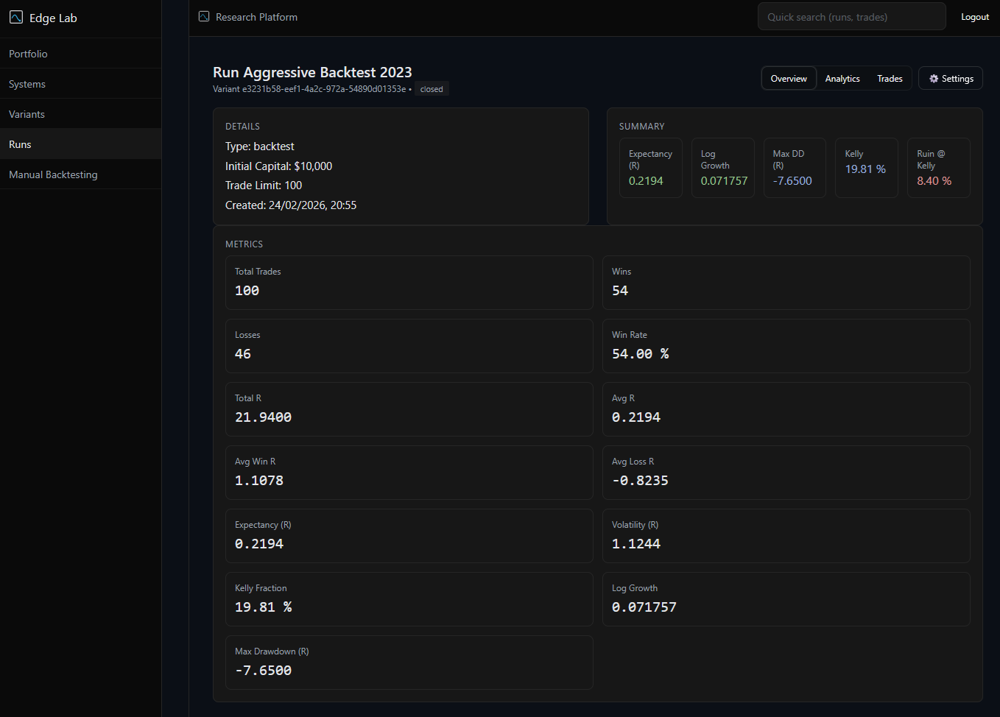
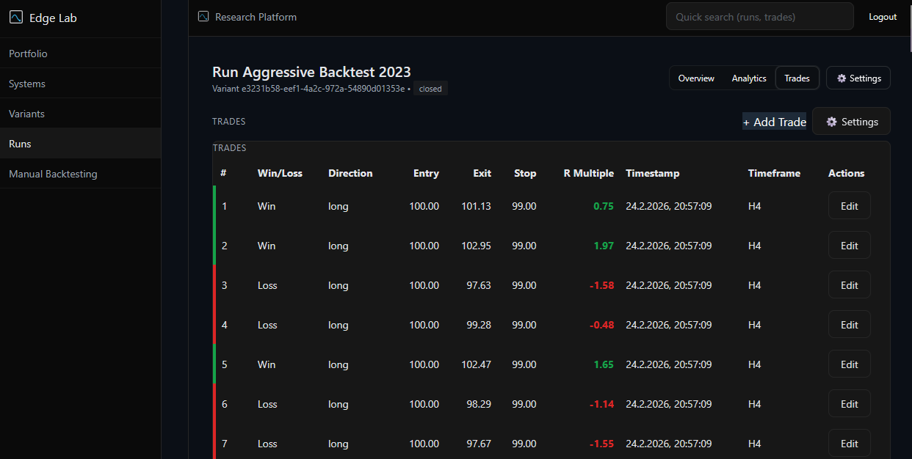
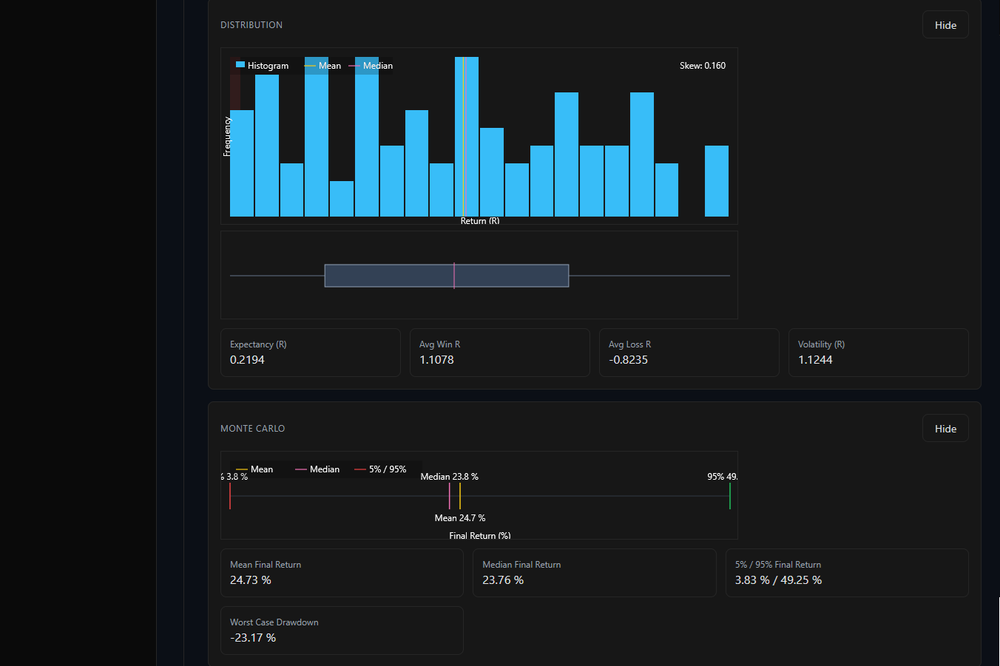

# Edge Lab

Edge Lab is a structured research platform for systematic trading. It emphasizes snapshot-based experimentation with clear invalidation rules and hard multi-tenant isolation. Determinism holds for transformations based on stored trades (e.g., equity construction). Stochastic components (Monte Carlo, Risk of Ruin) use IID bootstrap sampling without a fixed seed.

## Project Overview
- Persisted analytics at Run, Variant, Strategy, Portfolio levels
- Deterministic where derived from stored trades; stochastic engines use IID sampling without fixed seed
- Explicit compute endpoints; no compute-on-read
- Upward dirty propagation to enforce consistency
- Multi-user isolation embedded at DB, service, and route layers

## Core Philosophy
- Research discipline: Strategy → Variant → Run → Trades
- Analytics derive only from persisted lower-layer snapshots
- No hidden mutations; explicit recompute and invalidation
- Backtests treated as research samples

## Quick Look





## Architecture Diagram
```
User
└── Portfolio (default: single per user via partial unique index)
    └── Strategy (System)
        └── Variant (versioned, parameter_hash, parameters_json)
            └── Run (trade_limit, initial_capital)
                └── Trades (r_multiple, log_return, timestamp)

Analytics Snapshots
RunAnalytics (metrics_json, equity_json, …, is_dirty)
└── VariantAnalytics (aggregated_metrics_json, run_count, is_dirty)
    └── StrategyAnalytics (aggregated_metrics_json, variant_count, is_dirty)
        └── PortfolioAnalytics (combined_metrics_json, combined_equity_json, is_dirty)

Dirty Propagation
Run → Variant → Strategy → Portfolio
```

## Feature Overview
- R-multiple capital model and log-growth analytics
- Monte Carlo, Risk of Ruin, Walk Forward, Regime detection, Kelly simulation
- Deterministic equity series builder
- Tenant-aware unique constraints and index coverage
- Portfolio-level combined metrics and equity with equal-weight allocation
 - Note on growth metrics:
   - metrics.log_growth = mean(log(1 + R_multiple))
   - capital modeling uses 1% base risk: mean(log(1 + 0.01 * R_multiple))
   - These are distinct and documented separately

## Multi-User Isolation Model
- Ownership: user_id on all core tables with FK enforcement
- Constraints: tenant-aware unique keys (e.g., (user_id, name) on Strategy, Variant, Portfolio)
- Indexing: per-entity user_id indexes for selective queries
- Guards: route-level ownership checks and JWT-based auth; inactive users blocked
- Admin guard: privileged endpoints require admin; no global bypass paths

## Portfolio Governance Model
- Single default portfolio per user enforced by a partial unique index on (user_id) where is_default = true
- Strategy assigned to exactly one portfolio; moves mark both portfolios dirty
- Delete flow: non-default portfolios can be deleted; strategies reassign to default; default marked dirty
- Aggregation: PortfolioAnalytics combines clean StrategyAnalytics snapshots via equal-weight mean_log_growth and expectancy
- Portfolio compute performs a synthetic compounding over 50 steps:
  - capital *= (1 + weighted_mean_log_growth)
  - Does not merge real trade streams, ignores timestamps and correlations

## Analytics Snapshot System
- Explicit compute endpoints generate JSON snapshots; persisted to RunAnalytics, VariantAnalytics, StrategyAnalytics, PortfolioAnalytics
- Dirty flags indicate invalidation; compute clears dirty; propagation handled centrally
- No auto-recompute on read; GET endpoints return existing snapshots or error if missing
- Engines include MetricsEngine, EquityBuilder, KellySimulation, MonteCarlo, RiskOfRuin, WalkForward, RegimeDetection
- Determinism boundaries:
  - EquityBuilder is a pure transformation on stored trades
  - Regime detection uses KMeans with random_state=42
  - Monte Carlo and Risk of Ruin are stochastic IID bootstrap simulations without fixed seeds

## Admin Layer
- First-boot admin bootstrap endpoint
- Admin dashboard with system totals
- Managed user creation, activation, deactivation, password reset
- Read-only tenant inspection: list per-user strategies/variants
- Admin guard enforced via require_admin_user

## Deployment via Docker
- docker-compose orchestrates PostgreSQL, FastAPI backend, NGINX-built frontend
- Backend env: DATABASE_URL, JWT_SECRET (required by auth); container serves at :8000
- Frontend built with Vite; served by NGINX at :80; default route proxies /api to backend
- Database: PostgreSQL 15; data persisted via named volume

## Documentation
- Architecture: [docs/architecture.md](docs/architecture.md)
- Analytics: [docs/analytics.md](docs/analytics.md)
- Admin Layer: [docs/admin-layer.md](docs/admin-layer.md)
- Portfolio Engine: [docs/portfolio-engine.md](docs/portfolio-engine.md)
- UI Overview: [docs/ui-overview.md](docs/ui-overview.md)
- Deployment: [docs/deployment.md](docs/deployment.md)

## Roadmap
Edge Lab – Updated Roadmap

✅ Phase 1 – Multi-User Core (Completed)
Goal: Hard tenant isolation.
- user_id on all core entities
- FK constraints
- Query-level isolation
- Ownership helpers
- No global listing
- JWT-based authentication
- Argon2 password hashing
Status: Stable

✅ Phase 2 – Persisted Analytics Layer (Completed)
Goal: Deterministic snapshot-based analytics.
- RunAnalytics snapshot table
- Explicit compute endpoints
- Dirty-flag invalidation
- No auto-recompute on read
- Log-growth Kelly objective
- Vectorized Monte Carlo & RuR
- R-multiple unified engine
Status: Stable

✅ Phase 3 – Admin Layer (Completed)
Goal: Controlled multi-user hosting.
- Admin bootstrap endpoint
- Admin guard dependency
- User activation / deactivation
- Password reset
- Tenant inspection (read-only)
- CAPTCHA login protection
- No tenant bypass
Status: Stable

✅ Phase 4 – Portfolio Governance (Completed)
Goal: Structured capital grouping.
- Portfolio table
- Single-allocation model
- Default portfolio enforcement
- Partial unique index (1 default per user)
- Strategy reassignment on portfolio delete
- Portfolio dirty propagation
- Portfolio-level analytics aggregation
Status: Backend complete, UI aligned

🚧 Phase 5 – Documentation & Professionalization (In Progress)
Goal: Documentation & professionalization of repository.
- Architecture documentation
- Analytics documentation
- Admin documentation
- Deployment guide
- Screenshot documentation
- Structured roadmap
- Clean README
Deliverable: Application-ready repository

🔜 Phase 6 – Run Sharing
Goal: Controlled research collaboration.
- Read-only run sharing
- Token-based access
- Expiration support
- Isolated shared views
- No data mutation
- No cross-tenant analytics

🔜 Phase 7 – Portfolio Engine (Capital Logic)
Goal: Capital modeling layer.
- Capital allocation per portfolio
- Allocation strategies (static / proportional)
- Portfolio compounding model
- Portfolio-level drawdown analysis
- Cross-strategy exposure tracking
Note: Governance done, capital logic pending.

🔜 Phase 8 – Advanced Research Tooling
Goal: Quant expansion layer.
- Regime clustering
- Cross-asset correlation matrix
- Scenario stress testing
- Position sizing simulation engine
- Parameter surface analysis

🔜 Phase 9 – Data Import Layer
Goal: Frictionless onboarding.
- CSV trade import
- Broker export adapters
- Schema validation
- Batch ingestion pipeline
- Optional API ingestion

🔜 Phase 10 – Plugin & Extension System
Goal: External extensibility without core modification.
- Analytics plugin interface
- Strategy plugin interface
- Event hooks
- Custom execution adapters
- User-defined analytics modules
- Public API for external tools

🔮 Phase 11 – Event-Driven Analytics Engine (Long-Term)
Goal: Remove manual compute triggers.
- Event bus
- Automatic dirty propagation
- Async compute workers
- Job queue
- Deterministic compute versioning

## Screenshots


## License
MIT
