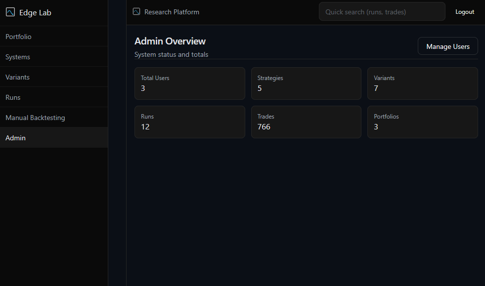
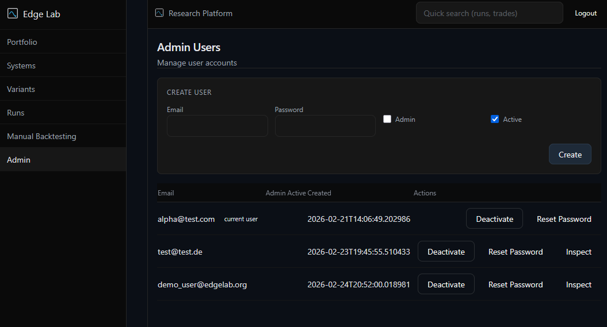
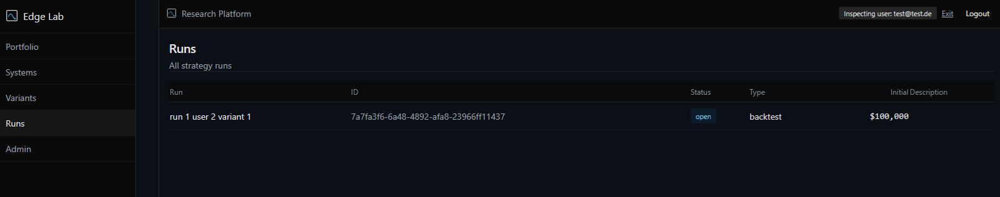
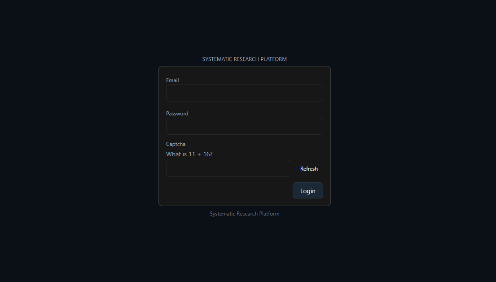

# Admin Layer

[GO BACK](../README.md)

## Bootstrap Process
- Admin /admin/bootstrap creates the first admin account when none exist
- Validates absence of existing admin and unique email before creation
- Creates the admin’s default portfolio and marks it dirty

## Admin Guard
- require_admin_user enforces admin privileges for all /admin routes
- Normal users cannot access admin endpoints; no bypass paths

## Tenant Inspection
- Read-only inspection endpoints list strategies and variants for a user
- Used for operational oversight without cross-tenant mutation

## Captcha Login Protection
- /auth/captcha issues short-lived math captchas
- /auth/login requires captcha_id and captcha_answer; single-use with expiry
- Prevents automated login attempts; integrated with standard credential checks

## No Global Bypass Logic
- Ownership checks at route/service layers
- Admin guard required for privileged operations; inactive users blocked at auth

## Screenshots

**Admin Dashboard Totals**

**User Administration**

**Inspection Mode (Read-only)**

**Login with Captcha**

