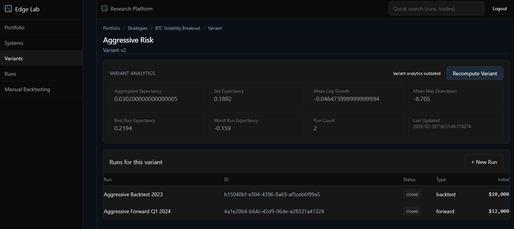

# Architecture

[GO BACK](../README.md)

## Entity Hierarchy
```
User
└── Portfolio
    └── Strategy (System)
        └── Variant
            └── Run
                └── Trades
```
- Strategy holds asset and description; assigned to exactly one Portfolio
- Variant versioned with parameter_hash and parameters_json
- Run scoped to Variant with initial_capital and trade_limit
- Trade stores r_multiple, raw/log return, direction, timestamp

## Snapshot Hierarchy
```
RunAnalytics
└── VariantAnalytics
    └── StrategyAnalytics
        └── PortfolioAnalytics
```
- RunAnalytics: metrics_json, equity_json and optional engines (walk_forward, monte_carlo, risk_of_ruin, regime, kelly), is_dirty
- VariantAnalytics: aggregated_metrics_json, run_count, is_dirty
- StrategyAnalytics: aggregated_metrics_json, variant_count, is_dirty
- PortfolioAnalytics: combined_metrics_json, combined_equity_json, strategy_count, is_dirty

## Dirty Propagation
```
Run change
→ VariantAnalytics.is_dirty = true
→ StrategyAnalytics.is_dirty = true
→ Portfolio.is_dirty = true
```
- Centralized in DirtyPropagationService
- Flags are manual invalidation markers; upper layers require explicit recompute

## Isolation Guarantees
- All core tables store user_id with FK constraints
- Tenant-aware unique keys (user_id, name) on Strategy, Variant, Portfolio
- Read/Write routes filter by current_user.id
- Admin guard required for privileged inspection

## Analytics and Determinism
- Compute endpoints write JSON snapshots; no compute-on-read
- EquityBuilder is a pure transformation of stored trades
- Regime detection uses KMeans with random_state=42
- Monte Carlo and Risk of Ruin use IID bootstrap sampling without fixed seed
- Portfolio aggregation composes equal-weighted StrategyAnalytics metrics

## No Auto-Recompute on Read
- GET endpoints return persisted data only
- Missing snapshots return 404 or explicit error
- Recompute is explicit via POST compute endpoints

## Portfolio Compute Model
- Uses clean StrategyAnalytics only
- Equal-weight synthetic compounding over 50 steps:
  - capital *= (1 + weighted_mean_log_growth)
- Does not merge real trade streams; ignores timestamps and cross-strategy correlation

## Diagram Blocks
```
Compute Flow
RunAnalytics.compute() → writes metrics/equity/engines, sets is_dirty=false
VariantAnalytics.compute() → aggregates clean runs, sets is_dirty=false
StrategyAnalytics.compute() → aggregates clean variants, sets is_dirty=false
PortfolioAnalytics.compute() → composes clean strategies, sets is_dirty=false
```

## Screenshots


