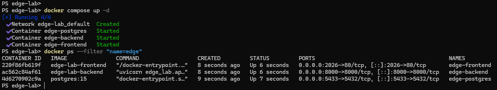

# Deployment

[GO BACK](../README.md)

## Docker Compose
- Services: db (PostgreSQL 15), backend (FastAPI), frontend (NGINX)
- db: exposes 5433→5432, named volume db_data
- backend: builds from backend/Dockerfile, exposes 8000, depends on db
- frontend: builds from frontend/Dockerfile, exposes 2026, depends on backend

## Backend
- FastAPI app served via uvicorn in container
- Environment:
  - DATABASE_URL (SQLAlchemy URL pointing to db service)
  - JWT_SECRET (required by auth; must be set securely)
- Editable install via pip in Dockerfile to include backend package

## Frontend (NGINX Build)
- Vite build produces static assets
- NGINX serves / and routes SPA via try_files
- Optional /api/ proxy to backend:8000 with headers

## PostgreSQL
- Default database, user, password configured in compose for local use
- Data persisted under docker volume db_data

## Environment Variables
- DATABASE_URL: postgresql+psycopg://edge:edge@db:5432/edge_lab (compose default)
- JWT_SECRET: must be provided; auth layer fails if missing

## Production Notes
- Use strong JWT_SECRET in production; rotate as needed
- Run backend without --reload in production
- Configure NGINX for TLS and stricter headers if internet-facing
- Use dedicated Postgres instance and managed backups

**Compose services**
