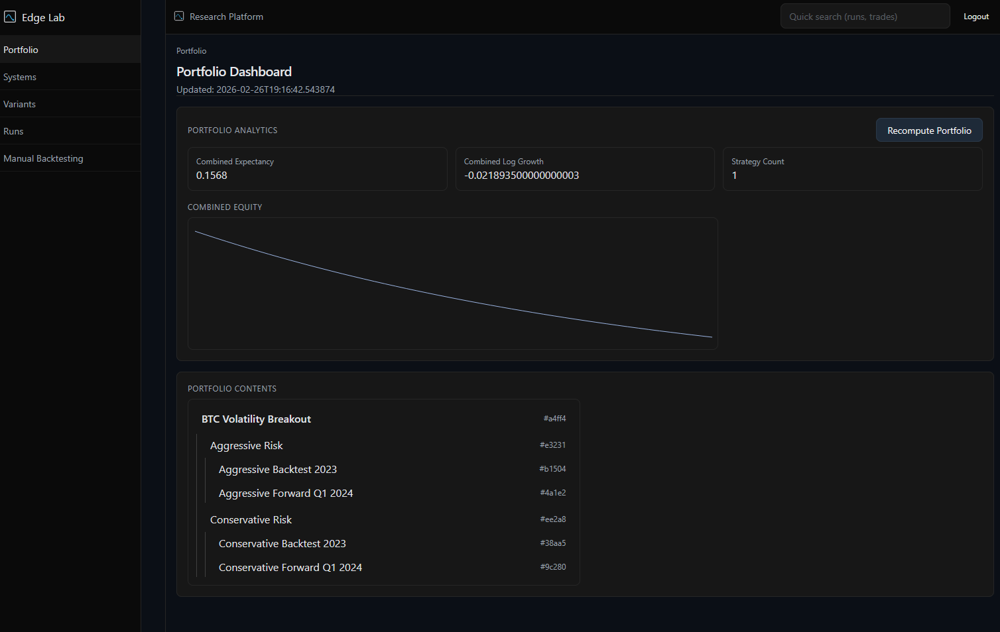

# Portfolio Engine

[GO BACK](../README.md)

## Single Allocation Model
- Strategies belong to exactly one portfolio via portfolio_id
- PortfolioAnalytics composes clean StrategyAnalytics with equal-weight allocation

## Default Portfolio Enforcement
- Each user has a single default portfolio (is_default = true)
- Enforced by a partial unique index on (user_id) WHERE is_default = true

## Partial Unique Index
- Database-level constraint prevents multiple defaults per user
- Migration creates uq_portfolios_user_default with partial uniqueness

## System Move Flow
- PUT /portfolio/{portfolio_id}/systems/{strategy_id} reassigns a strategy
- Old and new portfolios marked is_dirty = true
- Strategy’s portfolio_id updated; no duplication

## Deletion Reassignment
- Non-default portfolios can be deleted
- All strategies reassign to the default portfolio
- Default portfolio marked dirty to reflect changed composition

## Portfolio-Level Aggregation
- Combined metrics: mean_log_growth and expectancy via equal weights from clean StrategyAnalytics
- Synthetic equity: compounding over a fixed 50-step horizon using weighted mean_log_growth
  - capital *= (1 + weighted_mean_log_growth)
- Ignores trade timestamps and cross-strategy correlation; not a merged path of individual runs
- strategy_count tracked in PortfolioAnalytics

## Screenshots

