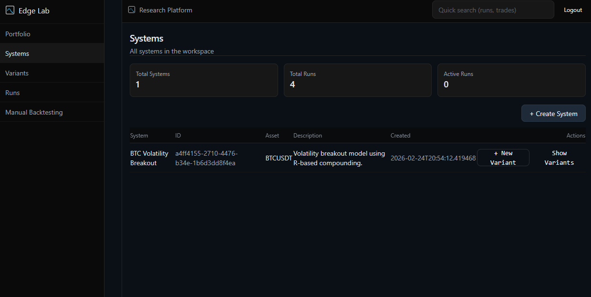
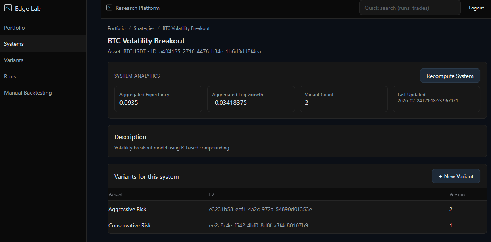
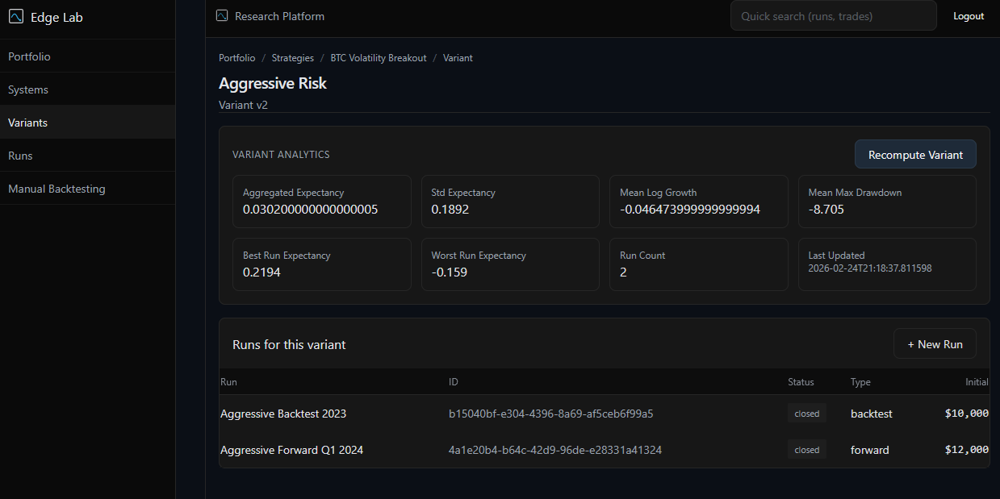
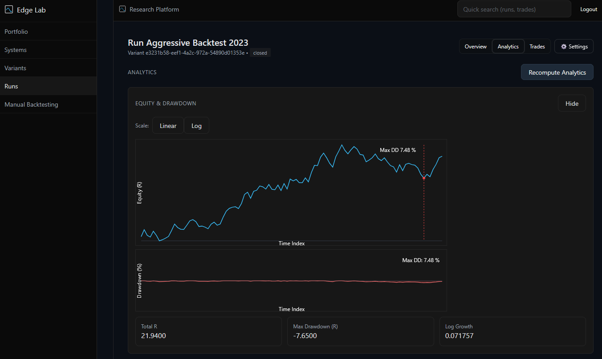
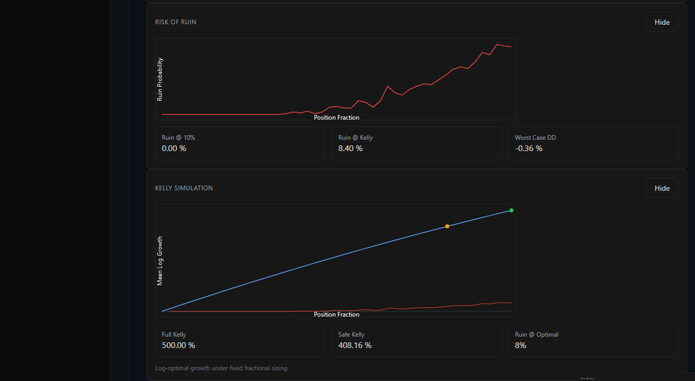
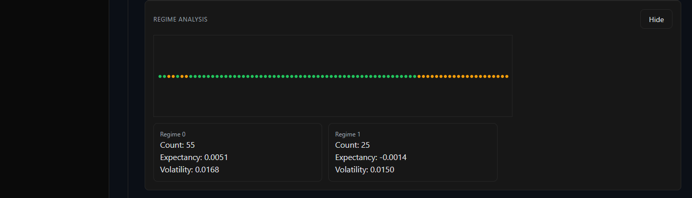

# UI Overview

[GO BACK](../README.md)

## Inspection Mode
- AdminInspectionContext toggles inspectionMode and selected user
- Compute actions disabled in inspection mode; views remain read-only

## Dirty Indicators
- Pages display badges when an entity or snapshot is dirty
- Example: Portfolio page shows “Recompute required” and dims analytics until recompute

## Governance Restrictions in UI
- Ownership checks enforced at API; UI surfaces restrictions (disabled buttons)
- System move and portfolio deletion actions follow server-side governance rules

## Snapshot Compute UX
- Compute buttons per layer: Run, Variant, Strategy, Portfolio
- Post-recompute polling retrieves updated snapshots; dirty flags cleared
- Explicit errors shown when snapshots are missing (404)

## Research-Focused Layout
- Hierarchical navigation: Systems → Variants → Runs
- Analytics panels grouped by engine: equity/drawdown, distributions, Monte Carlo, Risk of Ruin, Kelly, Walk Forward, Regime
- Portfolio dashboard summarizes combined metrics and equity

## Screenshots

**Systems List & Hierarchical Navigation**

**Dirty Indicator & Disabled Compute**

**Run Overview**

**Run Analytics Panels**

